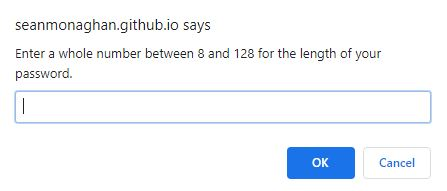
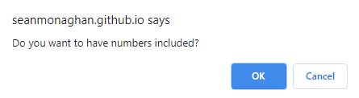
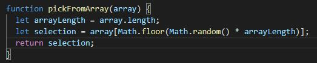
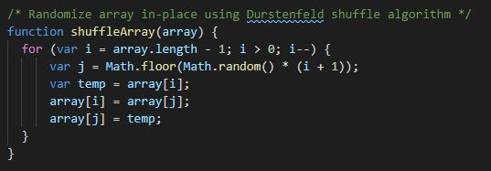

JavaScript: Password Generator

This is an application that generates a random password based on user-selected criteria. This app runs in the browser and features dynamically updated HTML and CSS powered by your JavaScript code. It also features a clean and polished user interface that is responsive, ensuring that it will adapt to multiple screen sizes.

## User's Request

```
This application is designed for someone who has access to sensitive data
and wants to generate a password that meets designated criteria.  A stronger 
password will provide stronger security for the users information.  

```

## App Functionality

```

When the Generate a Password button is clicked, the app will run
and will prompt the user for the password criteria.  

```



```

The app will validate that the criteria are properly selected and inform
the user if they have performed any errors.

The criteria that the app looks for when selecting a password is the 
length of the password, and then if the user wants to include lower case 
letters, upper case letters, numbers and/or symbols.

The code will validate which elements were selected, and add them into a
larger array using the spread syntax and draw upon them randomly to generate
the password.

```



```

In order to ensure that at least one of each element is included in the password, 
the first time an element's array is added to the final product array, a random character
from that array will be inputed into the password.

In order to counteract the inherent pattern this creates within the first four characters,
the whole final product array is randomized before being written for the user to view.  

```



```

The selected characters are all sent into an array 'let finalProduct = []' which is
then returned from the generatePassword function into the initially called writePassword()
function as the var 'password'.  

The passwordText.value, is then joined together with join('') to eliminate the
inherent commas from the array and then passed into the text area on the html where the
user is then able to view their generated password.  

```


